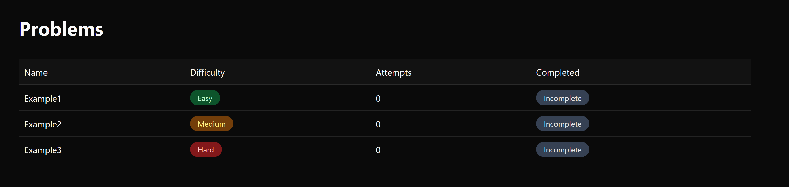
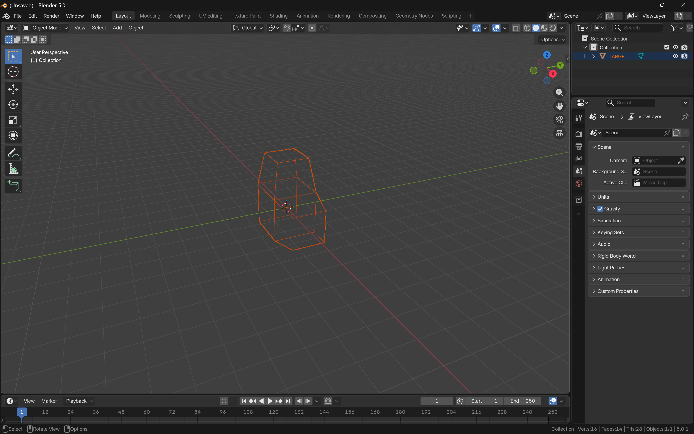
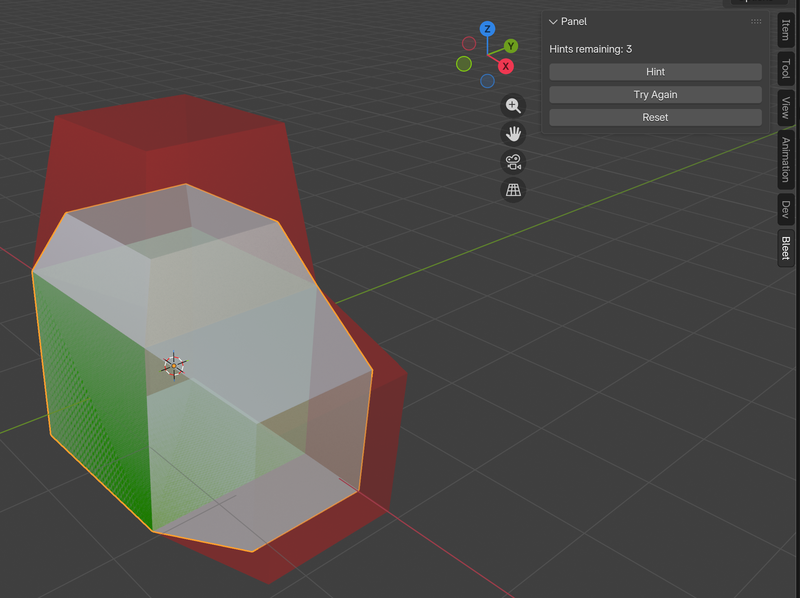
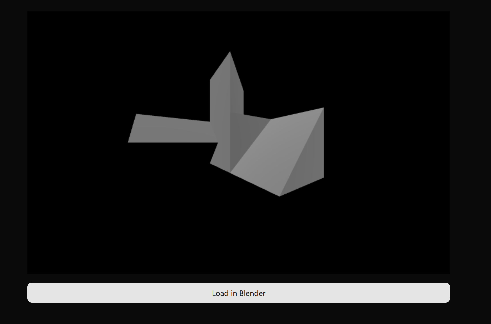
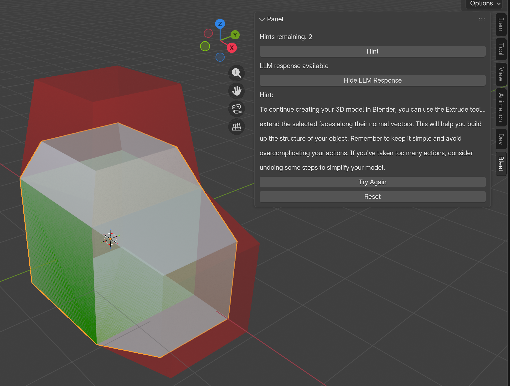
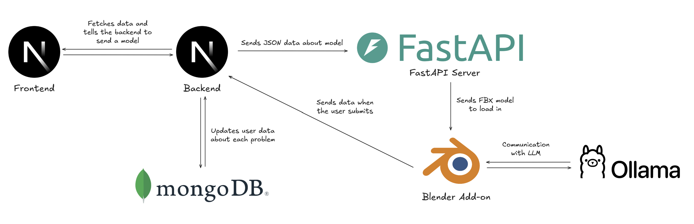

# bleet
**Grind Blender Smarter.**
 

## Inspiration
When many people start learning Blender (a free and open-source 3D modeling tool), they often begin with Blender Guru’s donut series.

It’s a great introduction, but once it ends, many learners realize something frustrating: they feel like they understand Blender... until they try to model something on their own. Suddenly, even simple objects require another YouTube tutorial, and they’re stuck in tutorial hell. 

This experience is surprisingly similar to learning data structures and algorithms: the theory makes sense, but when the co-op interview comes, it all falls apart. 

The difference between understanding and mastery is practice. So we asked ourselves—what if learning Blender worked the same way people practice LeetCode? 

That question is what led to the creation of bElite.

---

## What It Does

bElite is a **practice-driven learning platform for Blender**, inspired by LeetCode.

The workflow is simple:

1. Visit the website and select a modeling problem (with different difficulty levels).
2. Click the problem → Blender opens automatically.
3. Inside Blender:
   - You see a **wireframe reference model**
   - Your task is to **recreate it**
4. As you model:
   - bElite checks whether your vertices match the target (within a tolerance)
   - Faces turn **green** when they match, **red** when they don’t
5. You get **up to 3 hints**, powered by a multimodal LLM
6. When all vertices match → **Problem solved**
7. Move on and keep grinding

---
## Features
### Interactive Challenges:

  

- Easy, Medium, and Hard problems
- Track attempts and completion status
- Designed to build intuition, not memorization

 

### Reference Modeling Loading
Each problem loads a **target model** directly into Blender as a wireframe reference.

  

- Clear spatial reference
- Encourages correct proportions and topology
- No guessing what the final shape should be

 

### Incorrect Submission Detection
When the submitted model doesn’t match the target within tolerance, bElite gives immediate visual feedback.

  

- Faces turn **red** when vertices don’t align
- Makes debugging geometry intuitive
- Prevents “looks right but isn’t” mistakes

 

### Vertex-Level Correctness Feedback
When parts of your model match the target, faces turn **green**, letting you know exactly what’s correct.

  

- Green = correct geometry
- Red = incorrect geometry
- Learn *where* you’re wrong, not just *that* you’re wrong

 

### AI-Powered Hints (Multimodal)
Get contextual hints powered by a **multimodal LLM**.

  

- Uses:
  - Current mesh state
  - User action history
  - Viewport screenshot
- Gives guidance, not full solutions
- Limited hints to encourage problem-solving

---

## How We Built It
Fully integrated system from frontend → backend → Blender → AI.

  

### Blender Add-on
- Written entirely in **Python**
- Responsibilities:
  - Load the target model as a wireframe
  - Track user modeling actions (extrudes, scales, transforms)
  - Compare user vertices to the reference model
  - Highlight faces green/red based on correctness
  - Capture viewport screenshots
  - Send attempts & results to the backend

### FastAPI (inside Blender)
- A **FastAPI server** runs *inside* the Blender add-on
- Listens on `/convert`
- Accepts JSON describing a target object
- Converts that JSON into an **FBX file** that Blender can load

### LLM Hints (Local, Multimodal)
- Uses **LLaVA** via **Ollama**
- When a hint is requested:
  - Sends object transforms (position, rotation, scale)
  - Sends modeling action history
  - Sends a **Base64-encoded screenshot of the viewport**
- The LLM returns a contextual modeling hint (not a full solution)

### Web App & Backend
- **Next.js**
  - Frontend UI
  - API routes for:
    - Fetching model JSON
    - Submitting attempts
- **MongoDB**
  - Stores:
    - Attempts
    - Pass/fail status
    - User progress

