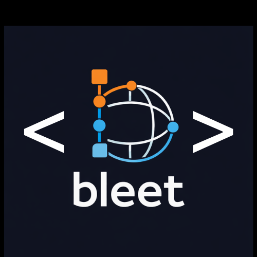

# bleet
**Grind Smarter.**

## Inspiration

When many people start learning Blender (a free and open-source 3D modeling tool), they often begin with **Blender Guru’s donut series**. It’s a fantastic introduction, but after finishing it, we realized something frustrating:

We *felt* like we knew Blender… until we tried to model something on our own.

Suddenly, we were stuck in **tutorial hell** unable to model even a simple object (like a car) without opening YouTube.

That feeling felt *very* familiar.

It’s the same experience people have when learning **data structures and algorithms**:  
You understand the theory… until the co-op interview. Then—uh oh—there goes your internship.

How do people fix that?  
The key is **practice**.

So we asked ourselves:

> **What if Blender learning worked the same way?**

That’s how **bElite** was born.

---

## What It Does

bElite is a **practice-driven learning platform for Blender**, inspired by LeetCode.

The workflow is simple:

1. Visit the website and select a modeling problem (with different difficulty levels).
2. Click the problem → Blender opens automatically.
3. Inside Blender:
   - You see a **wireframe reference model**
   - Your task is to **recreate it**
4. As you model:
   - bElite checks whether your vertices match the target (within a tolerance)
   - Faces turn **green** when they match, **red** when they don’t
5. You get **up to 3 hints**, powered by a multimodal LLM
6. When all vertices match → **Problem solved**
7. Move on and keep grinding

---

## How We Built It

### Blender Add-on
- Written entirely in **Python**
- Responsibilities:
  - Load the target model as a wireframe
  - Track user modeling actions (extrudes, scales, transforms)
  - Compare user vertices to the reference model
  - Highlight faces green/red based on correctness
  - Capture viewport screenshots
  - Send attempts & results to the backend

### FastAPI (inside Blender)
- A **FastAPI server** runs *inside* the Blender add-on
- Listens on `/convert`
- Accepts JSON describing a target object
- Converts that JSON into an **FBX file** that Blender can load

> This server runs on a separate thread **inside Blender** so it can safely call Blender functions like `load_model`.

### LLM Hints (Local, Multimodal)
- Uses **LLaVA** via **Ollama**
- Runs **locally**
- When a hint is requested:
  - Sends object transforms (position, rotation, scale)
  - Sends modeling action history
  - Sends a **Base64-encoded screenshot of the viewport**
- The LLM returns a contextual modeling hint (not a full solution)

### Web App & Backend
- **Next.js**
  - Frontend UI
  - API routes for:
    - Fetching model JSON
    - Submitting attempts
- **MongoDB**
  - Stores:
    - Attempts
    - Pass/fail status
    - User progress

**bElite** is about escaping tutorial hell—and actually learning Blender by doing.

